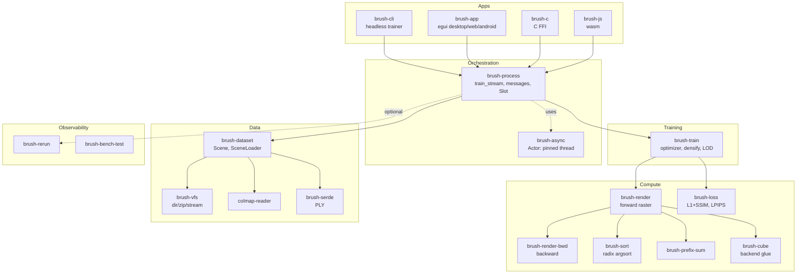
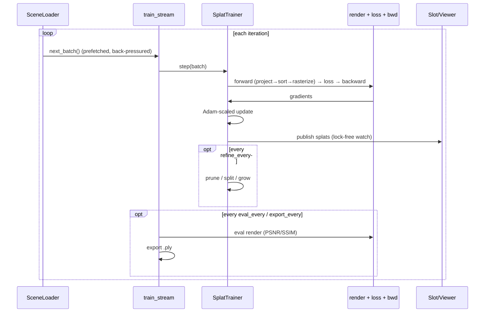

# Architecture

Brush is a Rust workspace: **4 apps** (entry points) over **19 crates** (engine). Compute runs
as **wgpu** compute shaders (Metal/Vulkan/DX12/WebGPU) through the **Burn** ML framework.

## Component map

## Backend
- Burn backends: `MainBackend = Wgpu` (autodiff) and `MainBackendBase = CubeBackend<WgpuRuntime>`
  (raw kernels) — `crates/brush-cube`.
- Device setup: `burn_init_setup()` or `burn_init_device(adapter, device, queue)` to share a
  host's wgpu device (`crates/brush-process/src/lib.rs:33,44`).
- Runtime options: `tasks_max: 64`, `MemoryConfiguration::ExclusivePages`
  (`crates/brush-process/src/lib.rs:26-31`).

## The training loop

Driver: `crates/brush-process/src/train_stream.rs:34`. The trainer awaits each batch, so the
loop self-throttles to data availability.

## Concurrency
- **`brush-async::Actor`** pins a future to a dedicated OS thread because cubecl/burn-fusion key
  GPU stream ordering on a thread-local id that tokio's work-stealing would scramble
  (`crates/brush-async/src/lib.rs:1-17`).
- `brush-cli` runs a multi-thread tokio runtime; a `cli-trainer` Actor pumps the message stream
  while the indicatif UI runs on the main task (`apps/brush-cli/src/lib.rs:84-93`).
- The data loader fans out `available_parallelism()` actors × 2 tasks into an `mpsc(4)`
  prefetch buffer (`crates/brush-dataset/src/scene_loader.rs:64-99`).

## Splats representation
| Tensor | Shape | Meaning |
|---|---|---|
| `transforms` | `[N,10]` | means(3) + rotation quat(4) + log-scales(3) |
| `sh_coeffs` | `[N, bands, 3]` | spherical-harmonics color (bands grow with `--sh-degree`) |
| `raw_opacities` | `[N]` | pre-sigmoid opacity |
| `min_scale` | `[N]` opt | Mip-Splatting 3D filter floor |

Source: `crates/brush-render/src/gaussian_splats.rs:62-74`.

## Messaging & viewer
Stages are emitted as `ProcessMessage`/`TrainMessage` (`crates/brush-process/src/message.rs`);
splat snapshots reach viewers through a lock-free `Slot` (`tokio::sync::watch`,
`crates/brush-process/src/slot.rs`). `brush-app` renders live via `SplatBackbuffer`.

See [data-flow.md](./data-flow.md) for the data path and [performance.md](./performance.md) for
the resource model.
