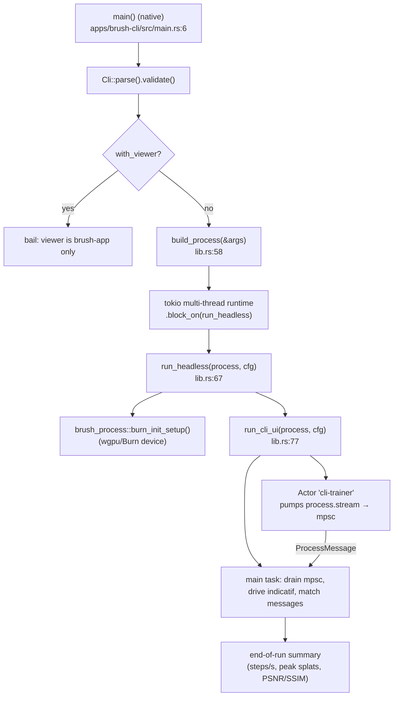

# brush-cli — Internals (functions & helpers)

Developer reference for the **code** of the `brush-cli` binary: every function/type it defines,
the helpers it relies on, and the control flow. For the user-facing flag reference see
[cli-reference.md](./cli-reference.md) (or the man page `docs/man/brush-cli.1`). Citations are
`file:line` against the current tree — re-grep if they drift.

The binary is intentionally tiny: two files, `apps/brush-cli/src/main.rs` and `lib.rs`. All heavy
lifting lives in `brush-process` (orchestration) and below.

## Control flow

## Functions & types defined by the binary

### `main()` — `main.rs:6` (native) / `main.rs:30` (wasm)
Native entry point. Parses `Cli`, validates, **rejects `--with-viewer`** (the CLI is headless;
the viewer is in brush-app), builds the process, then spins a **multi-threaded tokio runtime** and
`block_on(run_headless(...))`. The wasm build is an empty `fn main() {}` stub (the binary is
native-only; wasm uses brush-app/brush-js). Returns `anyhow::Result<()>`.

### `struct Cli` — `lib.rs:27`
The clap `Parser`. Fields:
- `source: Option<DataSource>` — positional `PATH_OR_URL` (`lib.rs:30`).
- `with_viewer: bool` — `--with-viewer` flag; defaults to `false` when a `source` is present
  (`default_value_if`, `lib.rs:32-38`).
- `train_stream: TrainStreamConfig` — `#[clap(flatten)]` of the five config groups
  (Train/Model/Dataset/Process/Rerun — see `brush-process::config`), so every training flag is
  parsed here (`lib.rs:40-41`).

### `Cli::validate(self) -> Result<Self, clap::Error>` — `lib.rs:45`
Guard: if `--with-viewer` is false **and** no `source` is given, returns a clap
`MissingRequiredArgument` error. Guarantees `build_process` can expect a source.

### `build_process(args: &Cli) -> Option<RunningProcess>` — `lib.rs:58`
Returns `None` if no source. Otherwise calls `brush_process::create_process(source, config_fn)`,
where `config_fn` merges the dataset's optional `args.txt` config with the CLI config via
`brush_process::args_file::merge_configs` (CLI wins). Shared by this binary and brush-app's
headless path.

### `run_headless(process, train_stream_config) -> anyhow::Result<()>` — `lib.rs:67`
Initializes the backend (`brush_process::burn_init_setup().await`, the wgpu/Burn device) then
delegates to `run_cli_ui`.

### `run_cli_ui(process, train_stream_config) -> anyhow::Result<()>` — `lib.rs:77`
The driver. Responsibilities:
- **Stream pump:** spawns a `brush_async::Actor` named `cli-trainer` that pulls
  `process.stream.next()` and forwards each message over an `mpsc::unbounded_channel`
  (`lib.rs:84-93`). The actor is held alive for the loop (dropping it kills the pump). This
  pins the GPU-touching stream to one OS thread (see `brush-async` rationale).
- **Logging:** wires `env_logger` through `indicatif`'s `LogWrapper` so log lines don't clobber
  the progress bars (`lib.rs:101-114`).
- **Progress UI:** a `MultiProgress` with a main spinner, a steps `ProgressBar` sized to
  `train_config.total_iters()`, an eval spinner, and a stats spinner (`lib.rs:116-177`).
- **Message loop:** drains the channel and matches `ProcessMessage` / `TrainMessage`
  (`lib.rs:188-280`) — updates spinners/bar, logs eval results, tracks summary state.
- **End-of-run summary (Phase 5):** tracks `last_iter`, `peak_splats`, `last_psnr/ssim`
  during the loop and prints `Training took … — N steps (X/s), peak P splats, final eval PSNR …`
  using steps measured from `start_iter` (`lib.rs:291-315`).

## Helpers / external API the binary depends on
These are not defined in brush-cli but are its effective "helper functions":

| Symbol | Crate | Role |
|---|---|---|
| `create_process(source, config_fn) -> RunningProcess` | brush-process (`lib.rs:97`) | Build the training stream + splat view. |
| `burn_init_setup() -> WgpuDevice` | brush-process (`lib.rs:33`) | Initialize wgpu/Burn device (RuntimeOptions: `tasks_max=64`, `ExclusivePages`). |
| `RunningProcess { stream, splat_view }` | brush-process (`lib.rs:66`) | The driveable process; `stream` yields `ProcessMessage`s. |
| `ProcessMessage` / `TrainMessage` | brush-process (`message.rs`) | Stage events: `NewProcess`, `StartLoading`, `TrainMessage{TrainConfig, Dataset, TrainStep, RefineStep, EvalResult, DoneTraining}`, `Warning`, `DoneLoading`. |
| `DataSource` | brush-vfs (re-exported) | Parsed `PATH_OR_URL`. |
| `Actor` | brush-async | Pins the stream pump to a dedicated thread (GPU stream-id invariant). |
| `merge_configs(&init, &cli)` | brush-process::args_file | Merge `args.txt` + CLI config. |
| `TrainStreamConfig` | brush-process::config | The flattened config (Train/Model/Dataset/Process/Rerun). |

## Why this shape
The binary is a thin driver so the *same* logic (`build_process`, the process stream) is reused by
brush-app's headless path. All training/render/data code lives in the workspace crates
([architecture.md](./architecture.md)); brush-cli only owns argument parsing, the tokio runtime,
and the terminal UI. The deeper pipeline (orchestration, kernels, data) is documented in
[architecture.md](./architecture.md) and [data-flow.md](./data-flow.md).
