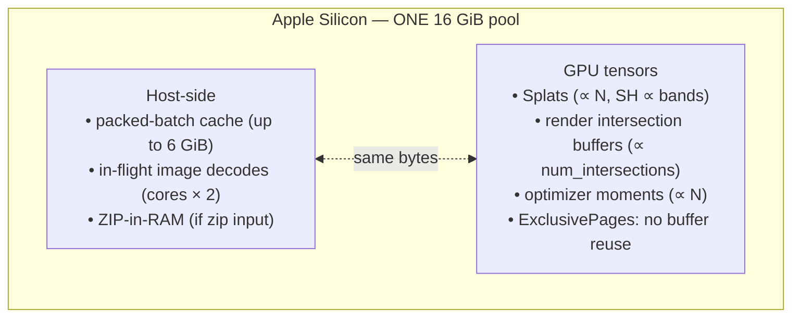
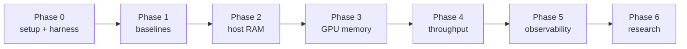

# Performance & Resource Model

This page explains where Brush spends memory and time, and the plan to make it frugal —
especially on **Apple Silicon (16 GiB unified memory)**, where host RAM and GPU memory are the
**same physical pool**.

## The unified-memory model

On a discrete-GPU machine the host cache and VRAM are independent. On Apple Silicon they add
up. A configuration that fits a 24 GB discrete GPU + 32 GB host can OOM a 16 GiB Mac. **All
budgets must be reasoned against the shared pool, and defaults should be safe on the smallest
target and scale up.**

## Where memory goes

| Consumer | Driver | Where | Default magnitude |
|---|---|---|---|
| Packed-batch cache | dataset size | `crates/brush-dataset/src/scene_loader.rs:12` | up to **6 GiB** |
| Image decode in-flight | CPU cores | `scene_loader.rs:73-78` | cores × 2 full images |
| ZIP archive | input | `crates/brush-vfs/src/lib.rs:185-208` | whole archive |
| Splat SH coeffs | `N`, `--sh-degree` | `gaussian_splats.rs` | dominant per-splat bytes |
| Splat count `N` | densification | `crates/brush-train` | up to `--max-splats` (10M) |
| Intersection buffers | scene/camera | `crates/brush-render` | data-dependent (OOM cliff) |
| GPU heap reuse | config | `crates/brush-process/src/lib.rs:29` | `ExclusivePages` (no reuse) |

## Where time goes
The hot path per step is **render forward → loss → backward → optimizer → (periodic
densify/eval/export)**. The upstream team has already heavily optimized this (see
`CHANGELOG.md` "Training performance": fused L1+SSIM, recomputed SSIM backward, sparse
gradients, packed u32 GT images, a ~50% faster radix sort). Remaining throughput work should be
**profiler-led** (see [profiling.md](./profiling.md)) rather than speculative.

## Optimization plan (summary)

> The detailed, tracked backlog with hypotheses, risks, and verification steps lives in
> `memory/todo.md` (gitignored). This is the public summary.

1. **Baselines first.** Measure peak RAM, GPU memory, steps/s, and PSNR/SSIM on 2→64-image
   slices before changing anything. No baseline ⇒ no optimization.
2. **Host RAM (highest, lowest-risk).**
   - Make the cache budget **adaptive** to available memory with a CLI override (today it is a
     hardcoded 6 GiB).
   - Add **LRU eviction** so a smaller budget keeps hot views instead of thrashing.
   - **Cap decode concurrency** independent of core count.
   - Consider **streaming ZIP** instead of full in-RAM.
3. **GPU / unified working set.**
   - Experiment with a **pooling memory config** vs `ExclusivePages` (verify correctness +
     NaN suite).
   - Ship a **low-memory profile preset** tuning `--max-splats`, `--sh-degree`, and
     densification thresholds for small datasets.
   - **Log peak `num_intersections`** to catch the OOM cliff.
4. **Throughput.** Profile with Tracy, add spans, tune prefetch depth / `tasks_max` against GPU
   utilization.
5. **Observability.** Cheap-by-default resource logging (RAM/GPU/splats), better end-of-run
   summary, profiling recipes.
6. **Research directions (evaluation candidates, verify against primary sources before use):**
   budgeted densification (*Taming 3DGS*, SIGGRAPH Asia 2024), densify-then-simplify
   (*Mini-Splatting*, ECCV 2024), prune + SH distillation + VQ (*LightGaussian*, NeurIPS 2024),
   compact/quantized attributes (*Compact 3DGS*, CVPR 2024; *EAGLES*, ECCV 2024).

## Hardware note (honest scope)
Brush's kernels are Metal/WebGPU **compute shaders** running on the **GPU cores**. The Apple
**Neural Engine (ANE) is not addressable** from wgpu/Metal compute; using it would require a
separate CoreML/BNNS implementation and is out of scope unless a future experiment proves an
isolated, large win.

## Tuning knobs available today (no code change) — **measured**
Verified on `tandt/truck` (64 frames, 5000 iters) vs the default-config baseline (847 MB peak):

| flag | peak RSS | vs baseline | quality (PSNR / SSIM) |
|---|--:|--:|---|
| _baseline_ (`--sh-degree 3`) | 847 MB | — | 25.32 / 0.894 |
| **`--sh-degree 1`** | **511 MB** | **−40%** | 25.20 / 0.892 (≈ noise) |
| `--sh-degree 2` | 572 MB | −32% | 25.12 / 0.893 |
| `--max-splats 300000` | 488 MB | −42% | 25.17 / 0.883 (+faster) |

**`--sh-degree 1` cut peak memory ~40% with quality within the measurement noise** — SH
coefficients dominate per-splat memory (degree 3 = 16 bands → degree 1 = 4 bands). Caveat: SH
degree controls *view-dependent* color; diffuse scenes (like truck) lose almost nothing, glossy
scenes lose more — tune per scene. Other knobs: `--max-resolution`, `--max-frames` /
`--subsample-frames`, `--refine-every` / `--growth-stop-iter` / `--growth-select-fraction`.
Full data: `memory/results/exp_config_sweep.md`. See [architecture.md](./architecture.md) §CLI
for the complete flag list.
