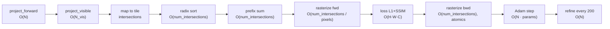

# Speed & Algorithmic Optimization

How to make Brush *train and render faster* — grounded in (a) the cost structure of the code
and (b) recent Gaussian-splatting research. Every external claim is attributed; **verify
against the primary source before implementing** (research summaries here are one-liners, not
substitutes for the paper).

> Companion to [performance.md](./performance.md) (memory). The central thesis links them:
> **splat count is the master variable for both speed and memory**, so the highest-value work
> is shared.

## 1. Where a training step spends time (from the code)

Per `SplatTrainer::step` (`crates/brush-train/src/train.rs`) → forward render → loss → backward
→ optimizer → (periodic) refine:

Cost drivers, in rough order of dominance for typical scenes:
1. **`num_intersections`** — the sort, forward rasterize, and backward rasterize all scale with
   the total number of (splat, tile) intersections. This is `N × average tiles-per-splat`
   (i.e. overdraw). Conservative tile bounds inflate it.
2. **`N` (splat count)** — projection, SH evaluation, the Adam update, and densification.
3. **Pixels (`H·W`)** — the loss kernel; fixed per resolution.

**Measured kernel breakdown (divan, 10-core 16 GiB Apple Silicon / Metal, median):**

| stage @ 1080p | 1M splats | 2.5M splats |
|---|--:|--:|
| forward render | 150 ms | 325 ms |
| backward render | 203 ms | ~420 ms |
| **full train step** (fwd+loss+bwd+optim) | **366 ms** | **608 ms** |

At 1M splats, forward+backward = 353 ms of the 366 ms step ⇒ **~96% of a training step is
forward+backward rasterization; backward is the single largest stage (~1.3–1.4× forward);
loss + optimizer ≈ 4%.** Both scale ~linearly with splat count; forward also grows ~64 ms per
megapixel. Full data + method: `memory/results/speed_analysis.md`.
_(Note: `cargo bench -p brush-sort` currently fails to compile against the pinned burn `main` —
a stale bench helper, not production code; tracked in `memory/todo.md`.)_

What's already optimized upstream (don't redo — see `CHANGELOG.md`): fused L1+SSIM forward,
SSIM backward recomputed (no tape), sparse gradients, packed u32 GT images, per-splat backward
early-out, and a radix sort rewritten ~50% faster (which lifted rendering 10–15%).

## 2. Why speed and memory converge
From our baselines (`memory/results/baseline_findings.md`): as densification grew splats
185k→566k, peak RSS rose 601→847 MB **and** per-step time rose enough that a 15k-iter run took
>22 min. Since the three dominant costs are all `O(N)` or `O(N·overdraw)`, **reducing splat
count at equal quality is simultaneously the biggest speed win and the biggest memory win.**
That is the strategic center of gravity.

## 3. Algorithmic levers (prioritized)

Legend: impact / effort / quality-risk. "Quality-risk" is judged against the project's **strict
no-quality-loss** rule (PSNR/SSIM must hold at matched iterations).

> **Measured note (2026-06-25):** of the levers below, the *cheap* ones were tested and gave
> **no macro speed win** on a full run: SH warmup (Tier 1a) is quality-neutral but only touches
> the first ~10% of iterations, and GPU memory_config pooling showed no benefit at sub-GiB
> scale (both reverted — see `memory/results/exp_*.md`).
>
> **Kernel audit (`memory/results/speed_kernel_audit.md`):** the proposed *kernel-level* speed
> levers are **already implemented optimally** by upstream — backward gradient accumulation
> (register-accumulate + single atomic per component; threads own distinct splats so there's no
> intra-group contention to aggregate, i.e. DISTWAR is moot), the native f32-atomic fast path,
> and tight per-tile culling (`will_primitive_contribute`). **There is no cheap, quality- and
> memory-neutral kernel tweak left.** The one remaining per-step speedup that keeps quality and
> *also* shrinks memory is **reducing splat count `N` at equal quality** (importance-based
> pruning / budgeted densification — Tier 2d/e). That is now the sole high-leverage speed lever,
> and it is simultaneously a resource win.

### Tier 1 — high impact, low risk

**(a) Progressive SH-degree warmup** — *impact: LOW (measured) · effort: low-med · risk: low.*
**Update:** implemented & tested — quality-neutral (correct gradient flow confirmed) but **no
measurable speedup** because the warmup window is only ~10% of training and SH is a fraction of
per-step cost (`memory/results/exp_sh_warmup.md`). Keep only as quality/stability insurance on
long runs, not as a speed lever.
SH evaluation, its backward, and its Adam update all scale with the number of active SH bands
`(d+1)²` (degree 3 → 16 bands × 3 channels). **Brush currently renders/optimizes full degree-3
SH from iteration 0** — confirmed: `max_sh_degree` is tracked but never used to ramp the active
degree (`train.rs:144,162`; render reads the full coeff count, `render.rs:66`). The **original
3DGS** method (Kerbl, Kopanas, Leimkühler, Drettakis, *"3D Gaussian Splatting for Real-Time
Radiance Field Rendering"*, SIGGRAPH 2023) **increases the active SH band every ~1000 iters**,
which both speeds early training and improves stability. Implement by threading an
`active_sh_degree(iter)` into the render/optimizer path (coeff tensor stays full-size, so
memory is unchanged; only compute drops early). Quality-neutral by construction — it's the
reference behaviour.

**(b) Tighter splat→tile intersection bounds** — *impact: med-high · effort: med · risk: none
(exactness only).* Classic 3DGS assigns each splat to a conservative rectangular tile range
from its 3σ radius, over-counting intersections (wasted sort + rasterize work). *Speedy-Splat*
(Hanson, Tu, Lin, … , CVPR 2025 — **verify**) computes exact per-tile coverage ("SnugBox")
plus aggressive pruning, cutting intersections and speeding rendering with no quality change.
Map to `map_gaussians_to_intersect` / the project kernels in `brush-render`. Pure efficiency,
no numerics change.

**(c) Confirm the Metal backward atomic fast path** — *impact: med · effort: low · risk: none.*
The backward rasterizer accumulates gradients with native `Atomic<f32>` fetch-add on Apple
Silicon (`HfAtomicAdd`) vs a `u32`-CAS fallback (`brush-render-bwd`). Verify the fast path is
actually selected on the M-series target — atomics dominate backward cost. (Apple-specific
profiling task.)

### Tier 2 — high impact, needs quality gating or more effort

**(d) Budgeted / score-based densification** — *impact: high · effort: med · risk: med
(quality-gated).* *Taming 3DGS* (Mallick, Goel, Kerbl, Carr, Franke, Steinberger et al.,
*"Taming 3DGS: High-Quality Radiance Fields with Limited Resources"*, SIGGRAPH Asia 2024) makes
splat count a **controlled budget** via per-splat scoring instead of an emergent threshold
result. Lower `N` at matched quality → faster + smaller. Maps onto Brush's growth knobs
(`--growth-grad-threshold`, `--growth-select-fraction`, `--growth-stop-iter`, `--max-splats`)
in `brush-train`. The top *training-speed* lever.

**(e) Densify-then-simplify / redundancy pruning** — *impact: high · effort: med · risk: med.*
*Mini-Splatting* (Fang & Wang, ECCV 2024) and *LightGaussian* (Fan, Wang, Kerbl … , NeurIPS
2024, importance pruning + SH distillation + vector quantization) reach similar quality with far
fewer Gaussians. Strong for the **export/LOD** path (Brush already has LOD baking) and for a
final "compaction" pass. Quality-gated.

**(f) Shared-memory atomic aggregation in backward (DISTWAR-style)** — *impact: med · effort:
med · risk: low.* *DISTWAR* (Durvasula et al., 2023) reduces global-atomic contention by
aggregating gradient contributions in fast on-chip memory (warp/threadgroup) before the global
atomic add. On Metal this maps to SIMD-group reductions in `rasterize_backwards`. Speeds the
backward without changing results. Aligns with the "accelerate on Metal" directive.

### Tier 3 — speculative / heavy

**(g) Second-order optimizer** — *impact: high (fewer iters) · effort: high · risk: high.*
*3DGS-LM* (Höllein et al., 2024) replaces Adam with Levenberg–Marquardt, reporting ~30% fewer
iterations to convergence; each step is heavier (Jacobian-vector products). Large change to the
optimizer path; prototype only if Tier 1–2 are exhausted.

**(h) View-consistent hierarchical rasterization** — *impact: quality++ , speed neutral/±.*
*StopThePop* (Radl, Steiner, Kerbl, Steinberger, SIGGRAPH 2024) adds per-pixel ordering
(removes popping) with hierarchical culling. Primarily a *quality/consistency* win; its
hierarchical culling can also trim work. Evaluate if popping/quality is a goal, not purely for
speed.

## 4. The metric that matters: time-to-quality
Optimize **wall-clock to reach a target PSNR/SSIM**, not raw steps/s. A change that halves
per-step time but needs 3× the iterations is a loss; budgeted densification that reaches target
quality with fewer/cheaper splats is a win even if steps/s looks similar. Report both
steps/s **and** time-to-target.

## 5. Recommended sequence
Measurement (§1) shows **backward rasterization is the largest single stage and forward+backward
are ~96% of a step**, both linear in N. So:
1. **Progressive SH warmup** (Tier 1a) — cheapest, quality-neutral, immediate; trims SH work in
   both fwd & bwd early. (Add an `sh_degree`-sweep bench first to quantify the SH share.)
2. **Backward atomic aggregation on Metal** (Tier 1c/2f) — directly targets the #1 stage;
   confirm the f32-atomic fast path, then SIMD-group pre-aggregation. No quality change.
3. **Tighter intersection bounds** (Tier 1b) — fewer intersections → less sort+rasterize work.
4. **Budgeted densification** (Tier 2d) — structural training-speed + memory win (scales fwd &
   bwd down together). Quality-gated.
5. Revisit Tier 3 only with data showing *convergence* (not per-step cost) is the wall.

> Caveat: divan benches use synthetic splats; confirm the same ranking on a real scene with
> Tracy before large investment. The qualitative result (fwd+bwd dominate, backward largest) is
> robust to scene choice because it follows from the O(N) kernel structure.

Each step: measure before/after on the chunked datasets, hold quality within the baseline noise
band, keep wasm/Android building. Track in `memory/todo.md` and `memory/process_contract.md`.
