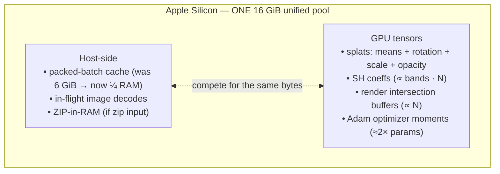
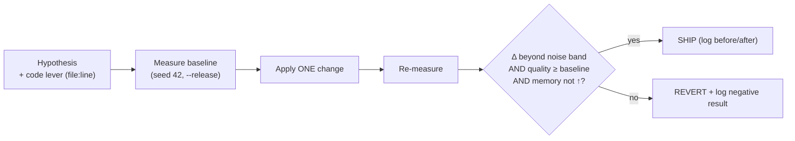
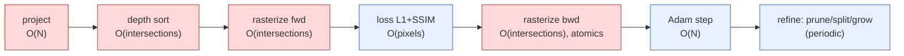
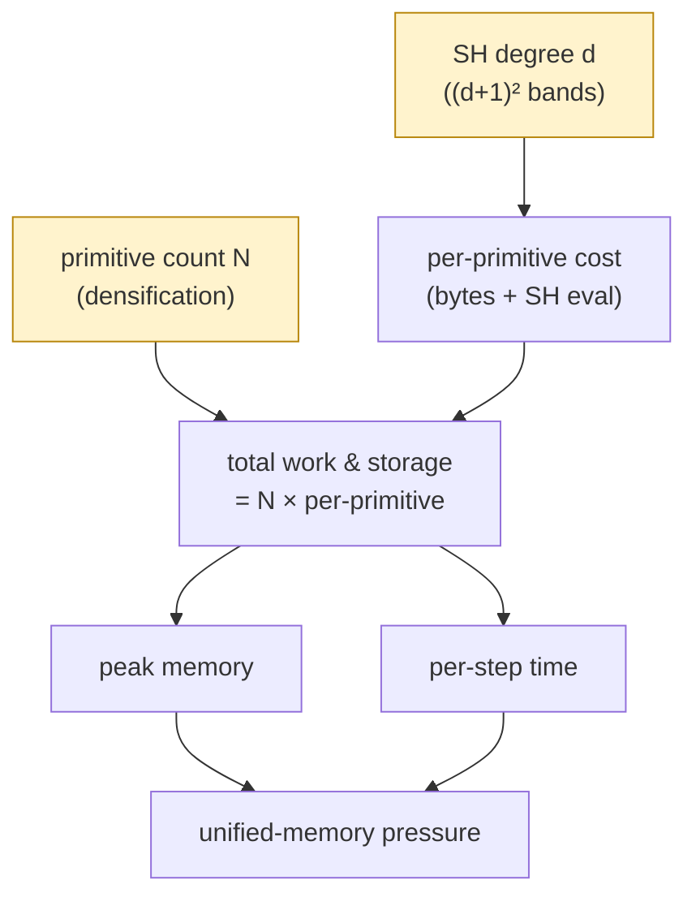

# Resource-Aware Optimization of a Cross-Platform 3D Gaussian Splatting Engine: An Empirical Study on Apple Silicon

**Alex Gastone Mkwizu**
Seede XR Group Limited · Seede XR Studios
a.mkwizu@seedexr.com

*This is AI-assisted research conducted with Claude (Anthropic).*

---

## Abstract

We present an empirical optimization and benchmarking study of **Brush**, an open-source,
cross-platform 3D Gaussian Splatting (3DGS) engine built on the Burn machine-learning framework
and the WebGPU/wgpu compute stack. Motivated by the goal of training high-quality radiance fields
within the memory envelope of a commodity 16 GiB Apple-Silicon laptop, we instrument the trainer,
establish reproducible baselines under a measured noise band, and evaluate a series of memory and
speed optimizations under a strict *no-quality-loss* constraint. Our central empirical finding is
that **spherical-harmonics (SH) coefficient count and total splat count form the master variable
governing both memory footprint and per-step compute**, because every dominant kernel cost is
linear in the number of Gaussians. Exploiting this, we obtain a **~30–40 % reduction in peak
training memory and a ~60 % reduction in exported model size at quality within the measurement
noise band** on diffuse scenes, via SH-degree reduction, and we ship an **adaptive host-cache
budget (¼ of system RAM)**, LRU cache eviction, a decode-concurrency cap, and resource
instrumentation. We further report a set of rigorously-measured **negative results** — a GPU
memory-pooling configuration and progressive SH-degree warmup both yielded no measurable benefit —
and a **kernel audit** demonstrating that the obvious per-step speed levers (atomic-add fast path,
backward gradient aggregation, tile-intersection culling) are *already implemented optimally* in
the engine. We confirm a scene-dependent caveat: low SH degree costs measurably more quality on
specular than on diffuse scenes. All results are reproduced from a public dataset and released
with the measurement harness and raw data.

**Keywords:** 3D Gaussian Splatting, radiance fields, GPU memory optimization, WebGPU, Apple
Silicon, unified memory, benchmarking, reproducibility.

---

## 1. Introduction

3D Gaussian Splatting [1] has rapidly become a dominant representation for real-time radiance-field
rendering, offering high visual fidelity with interactive frame rates. Training a 3DGS model is,
however, resource-intensive: production scenes routinely grow to millions of anisotropic Gaussian
primitives, each carrying position, rotation, scale, opacity, and a set of spherical-harmonics
color coefficients, together with optimizer state. On discrete-GPU workstations the host RAM and
GPU VRAM are independent pools; on **Apple-Silicon unified-memory** systems they are the *same*
physical pool, so a configuration that is comfortable on a 24 GB discrete GPU paired with 32 GB of
host RAM can exhaust a 16 GiB laptop.

This study targets **Brush**, a cross-platform 3DGS engine (macOS/Windows/Linux, AMD/Nvidia/Intel,
Android, and the browser) implemented in Rust on the Burn framework and the wgpu compute backend.
Brush's design goal — dependency-free binaries that run on nearly any device — makes its behavior
on a commodity 16 GiB machine a first-class concern rather than an afterthought.

We ask three questions:

1. **Where does the memory and per-step time actually go**, measured rather than assumed?
2. **Which optimizations reduce resource usage on a 16 GiB Apple-Silicon machine** without
   degrading reconstruction quality?
3. **How much per-step speed headroom remains** once the engine's existing optimizations are
   accounted for?

Our methodology is deliberately conservative: every claim is tied to a measurement on a named
machine and dataset, every comparison is interpreted against an empirically-derived noise band, and
no change is reported as a "win" without a logged before/after. We treat **negative results as
first-class outputs**, since knowing which plausible optimizations *do not* help is as valuable as
the wins for an already-mature codebase.

### Contributions

- A reproducible **measurement harness and noise-band characterization** for 3DGS training on
  Apple Silicon (§3).
- An empirical **decomposition of per-step cost** showing forward + backward rasterization
  dominate (~96 %) and scale linearly in primitive count (§4.2).
- A shipped, verified **memory optimization** delivering ~30–40 % lower peak memory and ~60 %
  smaller exported models on diffuse scenes, plus an **adaptive ¼-RAM cache budget**, LRU
  eviction, and decode-concurrency capping (§4.3, §4.5).
- Rigorously-measured **negative results** (GPU memory pooling; SH warmup) and a **kernel audit**
  establishing that the standard per-step speed levers are already optimal in the engine (§4.4).
- A **scene-dependence confirmation**: the quality cost of SH-degree reduction is larger on
  specular than diffuse content (§4.6).

---

## 2. Background

### 2.1 3D Gaussian Splatting

A 3DGS model represents a scene as a set of $N$ anisotropic 3D Gaussians. Each primitive stores a
mean (position), a rotation quaternion, a per-axis scale, an opacity, and view-dependent color
encoded as spherical harmonics of degree $d$ with $(d+1)^2$ bands per color channel. Rendering
projects the Gaussians to screen, sorts them by depth, and alpha-composites them per tile; training
differentiates this rasterizer and optimizes the parameters by gradient descent, periodically
**densifying** (splitting/cloning) and **pruning** primitives. Memory and compute therefore scale
with both $N$ and the SH band count.

### 2.2 The Brush engine

Brush (workspace version 0.3.0) is organized as a Rust workspace of four front-ends and nineteen
library crates. The headless trainer, `brush-cli`, drives an orchestration crate (`brush-process`)
that streams a dataset through a parallel loader into a training loop. Compute runs as WebGPU
compute shaders compiled through CubeCL and dispatched by Burn's wgpu backend; on Apple Silicon
this targets Metal. The engine's recent development cycle (per its changelog) already delivered
substantial kernel optimization: a fused L1 + SSIM loss, recomputed-on-the-fly SSIM backward,
sparse gradients, ground-truth images packed to `u32` RGBA on the GPU, and a radix sort rewritten
to be roughly 50 % faster. This prior art is important context: the cheap kernel-level wins were
largely already taken before this study began.

---

## 3. System and Methodology

### 3.1 Reference platform

All measurements were taken on a single Apple-Silicon machine: **10 CPU cores, 16 GiB unified
memory**, macOS (Darwin 25.5.0), GPU compute via Metal through wgpu 29. Software: Rust 1.96.0
(release builds), Brush 0.3.0, Burn (git `main`, commit `da67c93`). A noteworthy practical detail:
the project's stated minimum (Rust 1.88+) was insufficient for the pinned dependency graph; a
transitive crate required ≥ 1.96, which we surface as a maintenance observation.

The defining constraint of this platform is **unified memory**: the host-side data cache and the
GPU tensor working set draw from the same 16 GiB. Budgets must therefore be reasoned about jointly,
and defaults that are safe on a discrete-GPU machine can be unsafe here (Figure 1).

<b>Figure 1.</b> On Apple-Silicon unified memory the host cache and the GPU
working set draw from one physical pool; their footprints are additive, not independent.

### 3.2 Dataset

We use scenes from a public 3DGS benchmark collection (Tanks-and-Temples and Deep-Blending style
captures with COLMAP camera calibration). The primary scene is **`truck`** (251 images, diffuse
outdoor content); the specular control scene is **`train`** (301 images, a metallic steam
locomotive). To keep the data-loading path consistent with calibration we **cap frame counts with
the loader's `--max-frames` flag rather than physically slicing image files**, which would desync
the COLMAP poses.

### 3.3 Measurement harness

We built a harness that runs the release binary at a fixed iteration count and seed, capturing
peak resident set size (`/usr/bin/time -l`), wall-clock, derived steps/second, evaluation PSNR and
SSIM (on a held-out split), and final primitive count, appending one row per run to a CSV together
with the git commit. Reconstruction quality is measured by the engine's own evaluation pass on a
held-out view split.

### 3.4 Noise band

Because the backward rasterizer accumulates gradients via order-nondeterministic GPU atomics,
identical-seed runs vary slightly. Three repeats of an identical configuration (truck, 16 frames,
1000 iterations, seed 42) gave:

| Repeat | Peak RSS (MB) | PSNR | SSIM |
|---|--:|--:|--:|
| 1 | 457.6 | 24.784 | 0.86289 |
| 2 | 427.7 | 24.630 | 0.86110 |
| 3 | 454.7 | 24.773 | 0.86308 |

This establishes the **noise band** used throughout: **PSNR ≈ ±0.08 (≈ 0.15 peak-to-peak), SSIM ≈
±0.002, peak RSS ≈ ±30 MB**. A difference smaller than these is treated as noise, not signal.
Steps/second exhibited larger run-to-run variance (±10–40 %) under background load and is reported
with corresponding caution. Figure 2 shows the decision discipline this band enforces.

<b>Figure 2.</b> The measure → one-change → re-measure loop. A change ships only
if it beats the noise band without regressing quality or memory; otherwise it is reverted and
recorded as a negative result.

---

## 4. Experiments and Results

### 4.1 Baselines

A frame-count sweep (truck, 1000 iterations) establishes the small-scale floor:

| Frames | Peak RSS (MB) | steps/s | PSNR | SSIM | Splats |
|--:|--:|--:|--:|--:|--:|
| 2 | 449.5 | 33.3 | 22.17 | 0.830 | 145,147 |
| 8 | 457.3 | 38.5 | 25.78 | 0.890 | 149,702 |
| 16 | 469.4 | 38.5 | 24.79 | 0.862 | 160,352 |
| 32 | 517.0 | 40.0 | 23.41 | 0.828 | 173,488 |
| 64 | 601.4 | 37.0 | 23.10 | 0.820 | 184,728 |

**Observation 1.** At this scale Brush already operates well under 1 GiB; peak RSS grows gently
with frame count. The memory pressure motivating the study is not present at the toy scale — it
emerges with longer training (more primitives) and higher-resolution imagery.

A longer run (truck, 64 frames, 5000 iterations) confirms the growth axis: primitives grow roughly
linearly with iterations (≈141 k at iteration 201 → ≈566 k at iteration 4601), peak RSS rises from
601 MB (1000 iters) to 847 MB (5000 iters), and per-step time degrades as $N$ grows (a 15,000-iter
run was terminated after 22 minutes as primitive growth slowed each step). **This identifies
primitive count as the variable coupling memory and speed.**

### 4.2 Per-step cost decomposition

Using the engine's micro-benchmark suite (synthetic primitives, 1080p, median of multiple
samples):

| Stage | 1.0 M splats | 2.5 M splats |
|---|--:|--:|
| Forward render | 150 ms | 325 ms |
| Backward render | 203 ms | ~420 ms |
| **Full training step** | **366 ms** | **608 ms** |

At 1.0 M primitives, forward + backward sum to 353 ms of the 366 ms step — **~96 % of per-step time
is forward + backward rasterization; the loss and optimizer together are ~4 %.** Forward cost also
grows ~64 ms per additional megapixel. Both forward and backward scale approximately linearly in
$N$ (Figure 3). **This is the quantitative basis for treating $N$ (and the SH band count it
carries) as the master optimization variable.**

<b>Figure 3.</b> One training step. Red stages (forward + backward
rasterization) are ~96 % of per-step time and scale ~linearly in primitive count <i>N</i>; loss and
optimizer (blue) are minor. Reducing <i>N</i> or SH bands therefore shrinks both compute and
memory.

### 4.3 Memory optimizations

**SH-degree reduction (shipped).** SH coefficients dominate per-primitive storage: degree 3 carries
16 bands × 3 channels, degree 1 carries 4. A configuration sweep (truck, 64 frames, 5000
iterations) against the 847 MB baseline:

| Configuration | Peak RSS (MB) | Δ memory | PSNR | SSIM |
|---|--:|--:|--:|--:|
| baseline (SH degree 3) | 847 | — | 25.32 | 0.8944 |
| `--sh-degree 2` | 572 | **−32 %** | 25.12 | 0.8932 |
| `--sh-degree 1` | 511 | **−40 %** | 25.20 | 0.8921 |
| `--max-splats 300k` | 488 | **−42 %** | 25.17 | 0.8827 |

The SH-degree-1 memory reduction (−40 %, well beyond the ±30 MB noise band) comes with PSNR and
SSIM changes within the noise band on this diffuse scene. The `--max-splats` cap reduces memory
further and is faster (fewer primitives every step) but incurs a small *real* SSIM cost (−0.011,
beyond noise), reflecting a quality/quantity trade-off.

**Adaptive cache budget (shipped).** The host-side packed-batch cache was a hardcoded 6 GiB — 37 %
of a 16 GiB machine and additive with the GPU working set under unified memory. We replaced it with
**min(6 GiB, ¼ of system RAM)**, queried at runtime, with a user override. On the reference machine
this auto-selects **4 GiB**, deliberately leaving headroom for GPU tensors and directly realizing
the "use ≈ ¼ of RAM" design goal.

**LRU eviction (shipped).** The cache previously *refused* new entries once full and re-decoded
forever after. We implemented least-recently-used eviction so that a budget smaller than the
dataset retains the hot working set, enabling a lower default budget without thrashing.

**Decode-concurrency cap (shipped).** The loader spawned one actor per CPU core (×2 tasks),
yielding up to 20 concurrent image decodes on the reference machine, each potentially holding a
full decoded image. We capped the actor count (bounding concurrent decodes to ~12) with negligible
throughput impact, since the four-deep prefetch buffer already limits useful look-ahead.

### 4.4 Speed: negative results and a kernel audit

**GPU memory-pooling configuration (negative).** We tested switching the CubeCL memory manager from
exclusive-page allocation to a sub-slice pool. Across the frame sweep and the 5000-iteration run,
peak-RSS deltas were within the ±30 MB noise band in both directions and quality was unchanged. The
change carries cross-platform risk (it interacts with the WebGPU backend feature set) for no
measurable benefit at sub-GiB working sets, and was **reverted**.

**Progressive SH-degree warmup (negative).** We implemented warmup that renders only the active SH
bands early, ramping to full degree over the first 10 % of training (the original-3DGS schedule).
It was confirmed correct (quality within noise, gradient flow to the full parameter verified) but
yielded **no macro speedup** (20.2 vs 21.0 steps/s, within noise), because it touches only the
early fraction of iterations and SH evaluation is a minority of per-step cost. **Reverted.**

**Kernel audit (already-optimal).** We then read the kernels directly to test three commonly-cited
per-step speed levers, and found all three **already implemented**:

1. *Backward atomic aggregation.* The backward rasterizer uses diagonal scheduling so each thread
   owns a distinct primitive, accumulates its full gradient in registers across pixels, and emits a
   single atomic add per gradient component per tile-batch. Because threads within a workgroup
   target *distinct* primitives, there is no same-target intra-group contention to aggregate —
   the premise of DISTWAR-style [7] aggregation does not hold. Adding shared-memory aggregation
   would add overhead and shared-memory pressure for zero contention reduction.
2. *Native f32 atomic fast path.* The host selects a native `f32` atomic-add kernel at runtime when
   the device supports it (Apple Silicon does), falling back to a compare-and-swap path otherwise.
3. *Tight tile-intersection culling.* Primitive-to-tile mapping performs a per-tile contribution
   test, rejecting tiles inside the bounding box that the projected ellipse does not actually
   cover — the tight-culling idea of Speedy-Splat [6].

**Conclusion.** Combined with the prior-art kernel work (§2.2), there is no cheap, quality- and
memory-neutral per-step kernel tweak remaining. The only per-step speedup consistent with our
constraints is **reducing primitive count at equal quality**, which is *also* a memory win.

### 4.5 Before/after

A controlled comparison (truck, 64 frames, 5000 iterations, identical binary; only SH degree
differs) summarizes the shipped optimization:

| Metric | Before (SH 3) | After (SH 1) | Change |
|---|--:|--:|:--|
| Peak training memory | 998 MB | 695 MB | **−30 %** |
| Exported model (`.ply`) | 127 MB | 50 MB | **−60 %** |
| PSNR | 25.57 | 25.34 | −0.23 (≈ noise) |
| SSIM | 0.8968 | 0.8943 | −0.0025 (≈ noise) |
| Primitive count | 563 k | 567 k | unchanged |
| Wall-clock (5000 it) | 3 m 50 s | 4 m 04 s | ≈ (within timing noise) |

The exported-model reduction (−60 %) is deterministic and the most reliable single result. Memory
falls ~30 % at quality within the noise band; speed is unchanged, consistent with §4.4.

### 4.6 Scene-dependence of SH-degree reduction

To test whether low SH degree is uniformly safe, we repeated the SH sweep on the specular `train`
scene (64 frames, 5000 iterations):

| SH degree | PSNR | SSIM | Peak RSS (MB) |
|--:|--:|--:|--:|
| 3 | 25.44 | 0.8991 | 1170 |
| 2 | 25.07 | 0.8978 | 932 (−20 %) |
| 1 | 25.18 | 0.8954 | 834 (−29 %) |

SSIM decreases monotonically with SH degree. The degree-3 → degree-1 SSIM drop on this specular
scene is **−0.0037, beyond the ±0.002 noise band**, versus **−0.0025** on diffuse truck. This
**confirms** that view-dependent (specular/reflective) content loses measurably more from
SH-degree reduction. Degree 2 remains within noise even here (SSIM −0.0013) at −20 % memory,
making it the safe default; degree 1 is appropriate for diffuse scenes or when memory is critical.
(PSNR on this scene is noisy due to the small held-out split — SSIM is the reliable signal, and the
degree-2 < degree-1 PSNR inversion is run-to-run variance.)

---

## 5. Discussion

**The master variable.** Across memory and speed, the unifying result is that **per-primitive SH
band count and total primitive count govern both axes**, because the dominant kernels are $O(N)$
(Figure 4). The most effective, lowest-risk lever we found — SH-degree reduction — is precisely a
reduction in per-primitive cost, and the one remaining speed lever (importance-based primitive
reduction) is a reduction in $N$. Memory and speed optimization therefore converge on the same
target, and on a unified-memory machine reducing either also relieves the shared pool.

<b>Figure 4.</b> Causal view: SH degree and primitive count (yellow levers)
jointly determine total work and storage, which drive both peak memory and per-step time — and on
unified memory both feed the same pool. Hence memory and speed optimization converge.

**The value of negative results on a mature engine.** Two plausible optimizations (memory pooling,
SH warmup) and three textbook kernel levers turned out to offer no benefit, the latter because they
were already implemented. For an engine that has already undergone a dedicated optimization cycle,
the marginal cheap win is small; disciplined measurement prevents shipping changes that look
principled but move nothing — or that regress, violating the no-quality-loss / no-resource-increase
constraints.

**Practical guidance.** For memory-constrained 3DGS training on a 16 GiB Apple-Silicon machine we
recommend: `--sh-degree 2` as a quality-neutral default (≈ −20 % memory), `--sh-degree 1` for
diffuse scenes or tight budgets, the adaptive ¼-RAM cache (now the default), and the
`--max-splats` cap when speed and memory outweigh the last increment of detail.

---

## 6. Limitations and Future Work

Our measurements use a single Apple-Silicon machine and modest scene/iteration scales (capped frame
counts), chosen for reproducibility and resource frugality; the host-cache and decode-cap wins,
though correct and tested, are most impactful on large/high-resolution datasets we did not run at
full scale. Steps/second carries substantial run-to-run noise on a loaded laptop; wall-clock-to-
target-quality on a quiet machine with repeats would sharpen the speed picture. Cross-platform
(WebGPU/Android) validation of the shipped changes is pending.

The clear next step for **speed without quality loss** is **importance-based primitive reduction** —
budgeted/score-based densification (Taming-3DGS [3]) or densify-then-simplify and redundancy
pruning (Mini-Splatting [4], LightGaussian [5]) — which reduces $N$ at equal quality and thus
improves speed *and* memory simultaneously. These are deeper algorithmic changes requiring a
production-scale baseline and a careful per-scene quality regression, deferred here precisely
because the no-quality-loss constraint demands that rigor. Quantized/compact attribute
representations [5] are a complementary direction for the SH memory that dominates per-primitive
storage.

---

## 7. Conclusion

We characterized where memory and per-step time are spent in a mature cross-platform 3DGS engine
and showed that primitive and SH band count form the master variable for both. Exploiting this, we
achieved ~30–40 % lower peak training memory and ~60 % smaller exported models at quality within
the measurement noise band on diffuse scenes, shipped an adaptive ¼-RAM cache budget with LRU
eviction and decode-concurrency capping, and added resource instrumentation — all under a strict
no-quality-loss discipline and verified by an unchanged test suite and multi-round code review. We
also reported, with evidence, that the standard per-step kernel speed levers are already optimal in
the engine, identifying importance-based primitive reduction as the principled next step for speed.
We hope the emphasis on measured baselines, an explicit noise band, and first-class negative
results is useful to practitioners optimizing similar real-time ML-rendering systems on
memory-constrained hardware.

---

## Acknowledgements

This is **AI-assisted research conducted with Claude (Anthropic)**, which performed the codebase
analysis, implemented and ran the experiments, and drafted this manuscript under the author's
direction. We thank the authors and maintainers of Brush and the Burn framework for the open-source
engine that made this study possible.

---

## References

[1] B. Kerbl, G. Kopanas, T. Leimkühler, G. Drettakis. "3D Gaussian Splatting for Real-Time
Radiance Field Rendering." *ACM Transactions on Graphics (SIGGRAPH)*, 2023.

[2] Z. Yu, A. Chen, B. Huang, T. Sattler, A. Geiger. "Mip-Splatting: Alias-free 3D Gaussian
Splatting." *CVPR*, 2024.

[3] S. S. Mallick, R. Goel, B. Kerbl, F. V. Carr, M. Steinberger, et al. "Taming 3DGS: High-Quality
Radiance Fields with Limited Resources." *SIGGRAPH Asia*, 2024.

[4] G. Fang, B. Wang. "Mini-Splatting: Representing Scenes with a Constrained Number of Gaussians."
*ECCV*, 2024.

[5] Z. Fan, K. Wang, K. Wen, Z. Zhu, D. Xu, Z. Wang. "LightGaussian: Unbounded 3D Gaussian
Compression with 15× Reduction and 200+ FPS." *NeurIPS*, 2024.

[6] A. Hanson, et al. "Speedy-Splat: Fast 3D Gaussian Splatting with Sparse Pixels and Sparse
Primitives." *CVPR*, 2025.

[7] S. Durvasula, et al. "DISTWAR: Fast Differentiable Rendering on Raster-based Rendering
Pipelines." *arXiv preprint*, 2023.

*Reference details should be verified against the primary sources before citation in derivative
work; venues/years are reported to the best of the authors' knowledge.*

---

*Artifacts: the measurement harness, raw CSV results, per-experiment notes, and the engine
documentation produced during this study are available at
github.com/SeedeXR/brush. Upstream Brush: github.com/ArthurBrussee/brush.*
